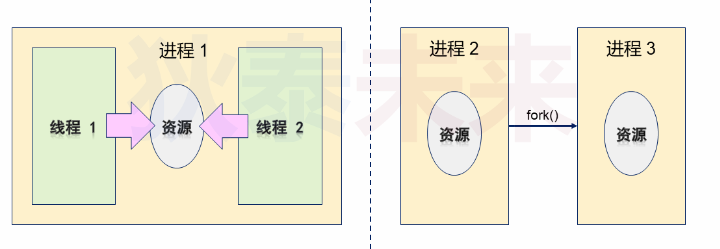

- [Linux线程编程初步](#linux线程编程初步)
  - [背景](#背景)
  - [线程和进程的关系](#线程和进程的关系)
    - [进程](#进程)
    - [线程](#线程)
    - [多进程 VS 多线程](#多进程-vs-多线程)
    - [Linux多线程API](#linux多线程api)
    - [多进程内存共享](#多进程内存共享)
  - [实验](#实验)
    - [实验一](#实验一)
    - [实验二](#实验二)


# Linux线程编程初步

## 背景
* Linux间接起源于Unix，Linux最初是不存在“线程”概念
* 而 POSIX Thread标准建立，Unix引入线程，大量函数被重新，信号机制变得非常复杂
* 2005年后，处理器厂商开始向**超线程**和多核架构靠拢

> 超线程是指单个处理器可以像2个逻辑处理器一样运行，这样单个处理器可以并行执行线程

一些概念
* 物理处理器：主机上的真实处理器硬件
* 逻辑处理器：逻辑处理器和超线程相关
  * 不支持超线程，逻辑处理器数量和物理处理器一样
  * 支持超线程，逻辑处理器数量是物理处理器的2倍
* 核心数：即处理器中内核数量

## 线程和进程的关系

### 进程
应用程序的一次加载执行（系统进行资源分配的单位）

### 线程
进程中的程序执行流

* 一个进程可以有多个线程（至少一个）
* 每个线程执行不同任务（可以并行执行）
* 同一个进程的多个线程共享系统资源


### 多进程 VS 多线程



* 创建/销毁耗时：线程 < 进程 （进程创建需要申请系统资源，线程不用）
* 多线程切换开销 < 多进程切换 （进程切换需要保存资源使用情况，线程不用）
* 线程间共享数据复杂度 < 多进程共享数据复杂度 (线程间共享系统资源，而进程间是独立的)
* 多线程代码稳定性 < 多进程代码稳定性 （多线程只要有一个挂了，整个进程就挂了，而多进程是互相独立的，挂了也不影响其他进程）
* 多线程代码复杂性 > 多进程代码复杂性 （多线程涉及资源共享使用）

### Linux多线程API

```C
#include <pthread.h>

/*p
pid: 进程标识符
attr: 进程属性设置，可设置NULL 即使用默认属性
start_route: 线程入口函数
arg: 线程入口函数参数 
*/
int pthread_create(pthread_t* pid, const pthread_attr_t* attr,
                    void*(start_route)(void*), void* arg);
        
// 返回当前线程ID
pthread_t pthread_self();

// 线程等待
int pthrad_join(pthread_t thread, void** retval);
```

### 多进程内存共享

```C
#include <sys/types.h>
#include <sys/ipc.h>
#include <sys/shm.h>

/*
pathname: 一个必须是已经存在的路径名
proj_id: 自定义一个ID，用于后续生成唯一的key
*/
key_t ftok(const char* pathname, int proj_id);

/*
key: 将共享内存跟key关联起来
size: 申请的共享内存大小，必须是 页大小(PAGE_SIZE)的整数倍
shmflg: IPC_CREATE : 创建一个共享内存, 如果不使用这个，会默认寻找key关联的共享内存
        IPC_EXCL: 跟IPC_CREATE配合使用，使用这个标志，确保如果共享内存段存在会返回错误
        SHM_HUGETLB：申请巨页内存
        其余的flag 参考open函数的flag
*/
int shmget(key_t key, size_t size, int shmflg);

/*
shmid: 由shmget返回的id
shmaddr: 如果shmflg包含 SHM_RND, 共享内存地址就会返回shmaddr指定的地址
shmflg：SHM_RND，
        SHM_RDONLY：只读权限
*/
void *shmat(int shmid, const void *shmaddr, int shmflg);
```

## 实验

### 实验一
性能对比：对比创建/销毁
```C
#include <stdio.h>
#include <unistd.h>
#include <time.h>
#include <stdlib.h>
#include <pthread.h>
#include <sys/types.h>
#include <sys/prctl.h>
#include <sys/wait.h>

#define LOOP_TIMES 100000
#define DIFFMS(t1, t2)\
    (t2.tv_sec - t1.tv_sec) * 1000 + (t2.tv_nsec - t1.tv_nsec) / 1000000

void* thread_proc(void* arg)
{
    return NULL;
}

void test_thread()
{
    struct timespec begin;
    struct timespec end;

    clock_gettime(CLOCK_MONOTONIC, &begin);

    for(int i = 0; i < LOOP_TIMES; i++)
    {
        pthread_t tid;
        pthread_create(&tid, NULL, thread_proc, NULL);
        pthread_join(tid, NULL);
    }

    clock_gettime(CLOCK_MONOTONIC, &end);

    printf("thread: %ldms\n", DIFFMS(begin, end));
}

void test_process()
{
    struct timespec begin;
    struct timespec end;

    clock_gettime(CLOCK_MONOTONIC, &begin);

    for(int i = 0; i < LOOP_TIMES; i++)
    {
        pid_t pid;

        pid = fork();

        if(pid > 0) 
        {
            waitpid(pid, NULL, 0);
        }
        else
        {
            exit(0);
        } 
    }

    clock_gettime(CLOCK_MONOTONIC, &end);

    printf("process: %ld ms\n", DIFFMS(begin, end));
}

int main()
{
    test_thread();
    test_process();

    return 0;
}
```

### 实验二
数据共享：多线程利用全局变量共享，多进程机制复杂

```C
#include <stdio.h>
#include <unistd.h>
#include <string.h>
#include <stdlib.h>
#include <pthread.h>
#include <sys/types.h>
#include <sys/fcntl.h>
#include <sys/ipc.h>
#include <sys/shm.h>
#include <sys/wait.h>

#define PATH "./"
#define PROJ_ID 66

void* proc(void* argv)
{
    char* buf = (char*)argv;

    strcpy(buf, "this is max here(thread)\n");

    return NULL;
}

void test_thread()
{
    pthread_t tid;
    char* buf = (char*)calloc(1, 128);

    int ret = pthread_create(&tid, NULL, proc, buf);

    if(ret == 0)
    {
        pthread_join(tid, NULL);

        printf("%s", buf);
    }

    free(buf);
}

void test_process()
{
    int shmid;
    key_t k;

    k = ftok(PATH, PROJ_ID);

    if(k >= 0)
    {
        shmid = shmget(k, 128, IPC_CREAT | S_IRWXU);

        int pid = fork();

        if(pid > 0)
        {
            char* s = (char*)shmat(shmid, NULL, 0);
            
            waitpid(pid, NULL, 0);

            printf("%s\n", s);
        }
        else if(pid == 0)
        {
            char* s = (char*)shmat(shmid, NULL, 0);

            strcpy(s, "this is max here(process)");

            exit(0);
        }
    }
}

int main()
{
    test_thread();
    test_process();
    return 0;
}
```
