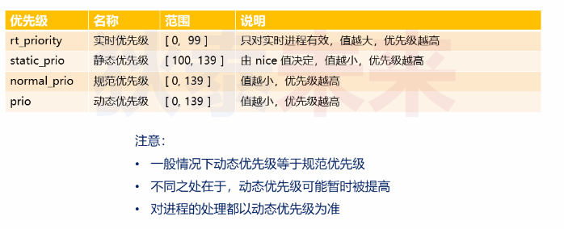

- [浅析进程优先级](#浅析进程优先级)
  - [什么是进程优先级](#什么是进程优先级)
  - [Linux中的进程类型（用户观点）](#linux中的进程类型用户观点)
    - [交互型进程](#交互型进程)
    - [批处理进程](#批处理进程)
  - [Linux中的进程类型（内核观点）](#linux中的进程类型内核观点)
    - [普通进程](#普通进程)
    - [实时进程](#实时进程)
  - [进程实时性和优先级](#进程实时性和优先级)
    - [实时性](#实时性)
    - [进程分类](#进程分类)
  - [进程优先级](#进程优先级)
  - [再论完全公平调度策略](#再论完全公平调度策略)
    - [完全公平策略如何计算进程获得多少时间片](#完全公平策略如何计算进程获得多少时间片)
    - [实验](#实验)
      - [API介绍](#api介绍)
  - [实时进程的调度策略](#实时进程的调度策略)

# 浅析进程优先级

## 什么是进程优先级
* 进程优先级：将处理器资源分配给进程的先后顺序
* Linux中每个进程都有相应的进程优先级(优先级可能会动态改变)
* 进程优先级决定进程何时执行，以及获取处理器的时间
* 进程优先级通常表现为一个整数值

## Linux中的进程类型（用户观点）

### 交互型进程

* 表现：比较多人机交互，进程不断进入阻塞状态，等待用户输入
* 特点：用户输入后，必须即时被唤醒执行处理

### 批处理进程

* 表现：不需要人机交互，在后台执行
* 特点：对时间不敏感，常用于数据处理

## Linux中的进程类型（内核观点）

### 普通进程

* 使用完全公平调度策略进程进程调度(```SCHED_OTHER```)
* 不能保证时间要求严格或者高优先级进程优先

### 实时进程

* 使用 ```SCHED_FIFO```或者```SCHED_RR```进行调度
* 根据进程优先级实时调度，在一定程度上保证实时性

## 进程实时性和优先级

### 实时性
* 硬实时 对时间要求非常严格，必须保证在一定时间完成
* 软实时 硬实时的弱化，允许一定程度上的超时时间

### 进程分类
* 普通进程 优先级[100, 139], 默认120，**值越小优先级越高**
* 实时进程 优先级[0, 99] **值越大优先级越高**

## 进程优先级



## 再论完全公平调度策略

* "完全公平" 不意味着都获得相同的时间片
* "完全公平" 指的是所有进程都能获得时间片

### 完全公平策略如何计算进程获得多少时间片
* 权重(weight)：进程按照权重分配时间片
* weight = 1024 / (1.25^nice)
* nice取值[-20, 19], 值越高权重越低

### 实验

父进程创建子进程，都进行复杂计算，子进程nice值设为5  
期望是父进程获得的时间片是子进程的3倍

#### API介绍

```C
#include <sys/time.h>
#include <sys/resource.h>

int getpriority(int which, int who);
int setpriority(int which, int who, int prio);
/*
which : 
  PRIO_PROGRESS: 指进程 
  PRIO_PGRP：进程组
  PRIO_USER：用户组
who：
  进程号或者进程组号
*/
```

```C++
#include <stdio.h>
#include <stdlib.h>
#include <sys/types.h>
#include <unistd.h>
#include <math.h>
#include <errno.h>
#include <sys/time.h>
#include <sys/resource.h>

static void heavy_work()
{
    int i = 0;
    
    while( 1 )
    {
        sin(i++);
    }
}

static int set_nice(int nice)
{
    return setpriority(PRIO_PROCESS, 0, nice) == 0;
}

int main()
{
    int pid = fork();
    
    if( pid > 0 )
    {
        printf("pid = %d, ppid = %d, pgid = %d\n", 
                getpid(), getppid(), getpgrp());
                
        if( set_nice(0) )
        {
            heavy_work();
        }
        else
        {
            printf("set nice_value failed...\n");
        }
    }
    else if( pid == 0 )
    {
        printf("pid = %d, ppid = %d, pgid = %d\n", 
                getpid(), getppid(), getpgrp());
                
        if( set_nice(5) )
        {
            heavy_work();
        }
        else
        {
            printf("set nice_value failed...\n");
        }
    }
    else
    {
        printf("child process create failed...\n");
    }

    return 0;
}

```

## 实时进程的调度策略